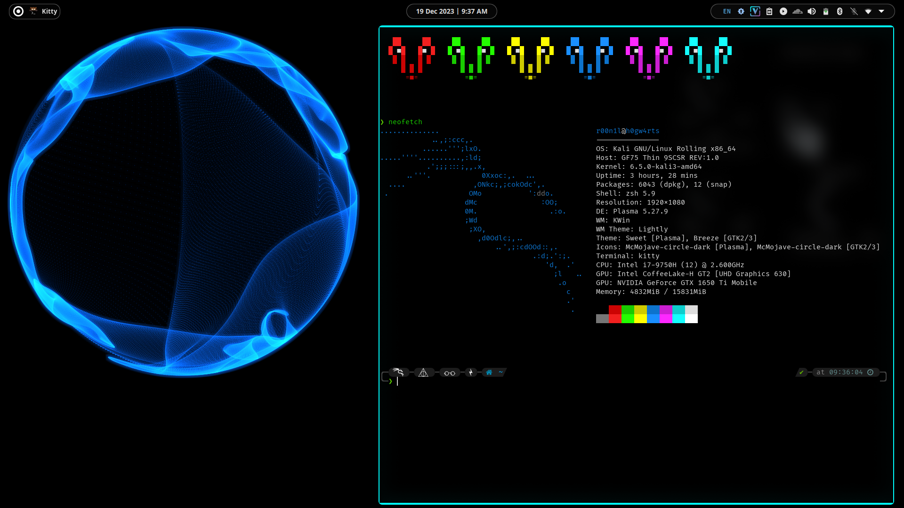
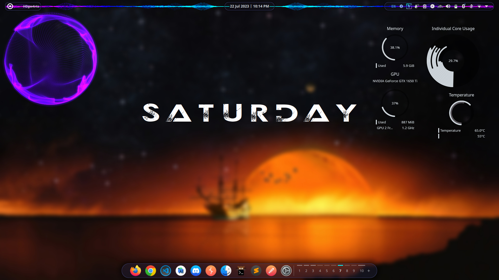
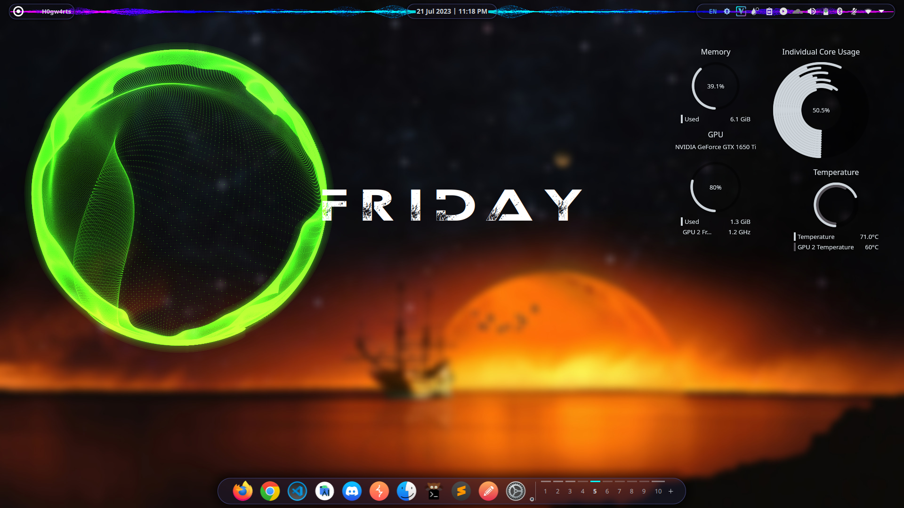

# NCS_Spectrum_GLava


This is an attempt to replicate the well-known NCS Spectrum Audio Reactor, implemented for GLava. This builds upon the previous work I did (located at https://github.com/Roonil/-OLD-NCS_Spectrum_GLava), which implemented 9 fragment shader buffers to maintain particles' positions. The new approach uses imageLoad(), imageStore() and atomic image operations to keep track of the particles' positions and also their 'depth', to determine the number of particles that are superimposed onto a given position. This produces super-accurate results, providing 60 FPS and utilizing less than 40% of an NVIDIA GTX 1650 Ti Mobile @ 1.2 GHz (underclocked) at 380x380 resolution. At 760x760 resolution, it gives 60 FPS with 80% utilization (underclocked). OpenGL version >=4.2 is required to use image-based operations, although some other extensions can enable these features regardless.  

https://github.com/Roonil/NCS_Spectrum_GLava/assets/15421185/453a3237-07dd-480e-b20b-c07df2d87006

# Installation Instructions
1. Get GLava's source code from https://gitlab.com/wild-turtles-publicly-release/glava/glava
2. Compile GLava after doing these changes in the render.c file (located in glava/glava/render.c):
    1. Fix time variable by changing
```.src_type = SRC_SCREEN``` to ```.src_type = SRC_TIME``` at line 657 (Located after ```#define SRC_TIME 5```)
    2. Add the following code after line 1586 and before line 1587 (between ```glBindFragDataLocation(id, 1, "fragment");``` and ```glUseProgram(0);```:
 ```
GLuint imageTexture;
int w, h;
gl->wcb->get_fbsize(gl->w, &w, &h);
glGenTextures(1, &imageTexture);
glBindTexture(GL_TEXTURE_2D, imageTexture);
glTexStorage2D(GL_TEXTURE_2D, 1, GL_RGBA32F, w, h);
glTexParameteri(GL_TEXTURE_2D, GL_TEXTURE_MIN_FILTER, GL_LINEAR);
glTexParameteri(GL_TEXTURE_2D, GL_TEXTURE_MAG_FILTER, GL_LINEAR);
GLuint imageUnit = 4;
glBindImageTexture(imageUnit, imageTexture, 0, GL_FALSE, 0, GL_READ_WRITE, GL_RGBA32F);
GLuint program = id;
GLint imageLocation = glGetUniformLocation(program, "imageTexture");
glProgramUniform1i(program, imageLocation, imageUnit);
glBindTextureUnit(0, imageTexture);

GLuint atomicImageTexture;
glGenTextures(1, &atomicImageTexture);
glBindTexture(GL_TEXTURE_2D, atomicImageTexture);
glTexStorage2D(GL_TEXTURE_2D, 1, GL_R32UI, w, h);
imageUnit = 5;
glBindImageTexture(imageUnit, atomicImageTexture, 0, GL_FALSE, 0, GL_READ_WRITE, GL_R32UI);
imageLocation = glGetUniformLocation(program, "atomicImageTexture");
glProgramUniform1i(program, imageLocation, imageUnit);
glBindTextureUnit(0, atomicImageTexture);
```
3. After compilation, in rc.glsl file located at home/.config/glava/, change:<br /> ```#request setversion 3 3``` to ```#request setversion 4 5```, and <br /> ```#request setshaderversion 330``` to ```#request setshaderversion 450``` (alternatively, try 420, 430 or 440 for setshaderversion). It is also recommended to use ```#request setmirror true``` (false by default in the file) as the visualiser then processes audio from both channels combined. In case a surrounding window appears or a change in the frame rate is desired, refer to GLava's documentation to set these parameters in rc.glsl.
4. Clone the repository and copy both the 'ncs' folder and 'ncs.glsl' file into home/.config/glava directory.
5. Tweak parameters in ncs.glsl to customise the appearance of the visualiser. Using an IDE such as VSCode may help easily navigate through the parameters in the file.
6. Run the module with ```glava -m ncs``` (Suggested resolution in rc.glsl: 380x380)

# Screenshots





