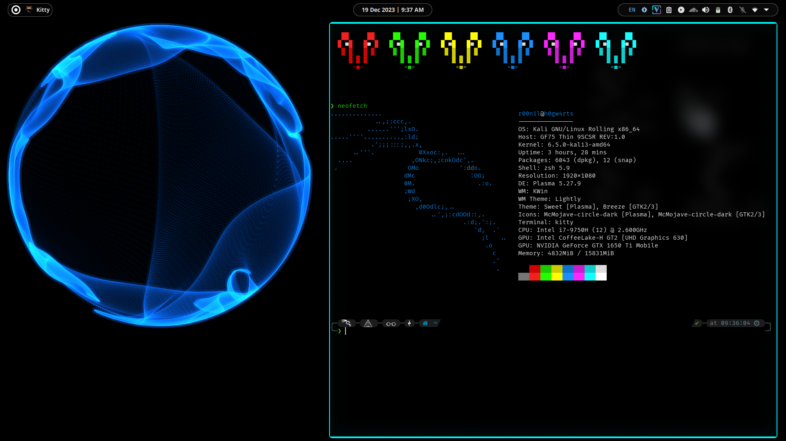
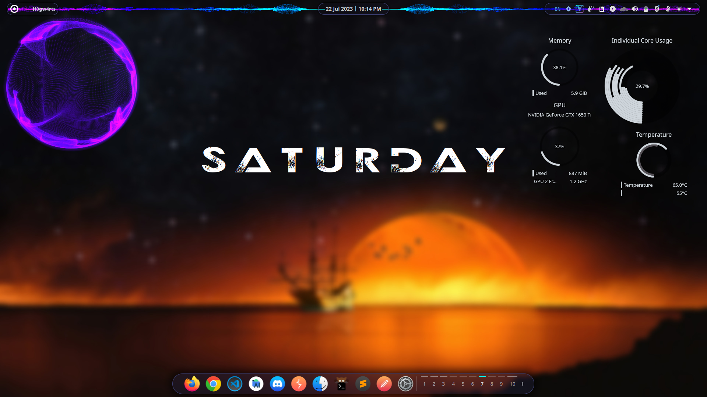
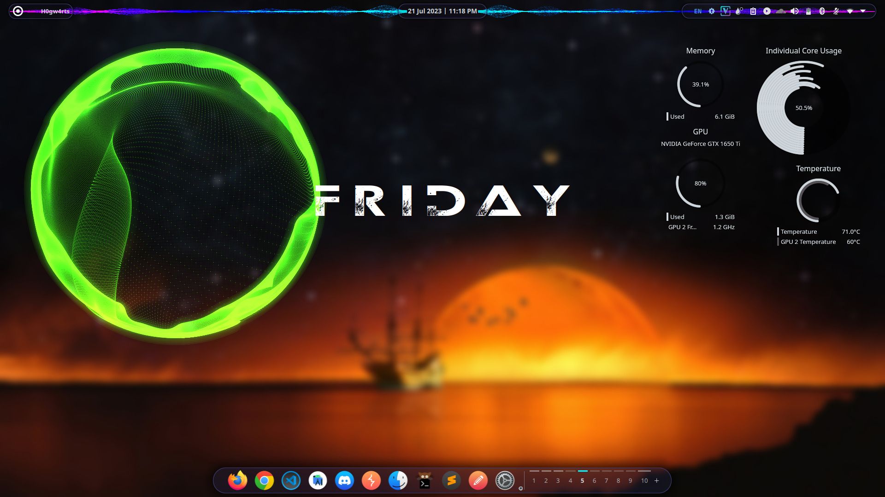

# NCS_Spectrum_GLava



This is an attempt to replicate the well-known NCS Spectrum Audio Reactor, implemented for GLava. This builds upon the previous work I did (located at https://github.com/Roonil/-OLD-NCS_Spectrum_GLava), which implemented 9 fragment shader buffers to maintain particles' positions. The new approach uses imageLoad(), imageStore() and atomic image operations to keep track of the particles' positions and also their 'depth', to determine the number of particles that are superimposed onto a given position. This produces super-accurate results, providing 60 FPS and utilizing less than 40% of an NVIDIA GTX 1650 Ti Mobile @ 1.2 GHz (underclocked) at 380x380 resolution. At 760x760 resolution, it gives 60 FPS with 80% utilization (underclocked). OpenGL version >=4.2 is required to use image-based operations, although some other extensions can enable these features regardless.

https://github.com/Roonil/NCS_Spectrum_GLava/assets/15421185/453a3237-07dd-480e-b20b-c07df2d87006

# Installation Instructions

1. Clone the repository and copy both the `ncs` folder and `ncs.glsl` file into `home/.config/glava` directory.

2. Get GLava's source code from https://gitlab.com/wild-turtles-publicly-release/glava/glava, and apply the patch as follows:

```
git clone https://gitlab.com/wild-turtles-publicly-release/glava/glava
cd glava
patch glava/render.c < path/to/patch/file.patch
```

Where `path/to/patch/file.patch` is the patch file from this repository.

3. Build and install GLava:

```
meson build --prefix /usr
ninja -C build
sudo ninja -C build install
```

4. After compilation, in `rc.glsl` file located at `home/.config/glava/`, change:<br /> `#request setversion 3 3` to `#request setversion 4 5`, and <br /> `#request setshaderversion 330` to `#request setshaderversion 450` (alternatively, try 420, 430 or 440 for setshaderversion). <br />It is also recommended to use `#request setmirror true` (false by default in the file) as the visualiser then processes audio from both channels combined. In case a surrounding window appears or a change in the frame rate is desired, refer to GLava's documentation to set these parameters in `rc.glsl`.

5. Tweak parameters in `ncs.glsl` to customise the appearance of the visualiser. Using an IDE such as VSCode may help easily navigate through the parameters in the file.

6. Run the module with `glava -m ncs` (Suggested resolution in rc.glsl: 380x380)

# Screenshots




